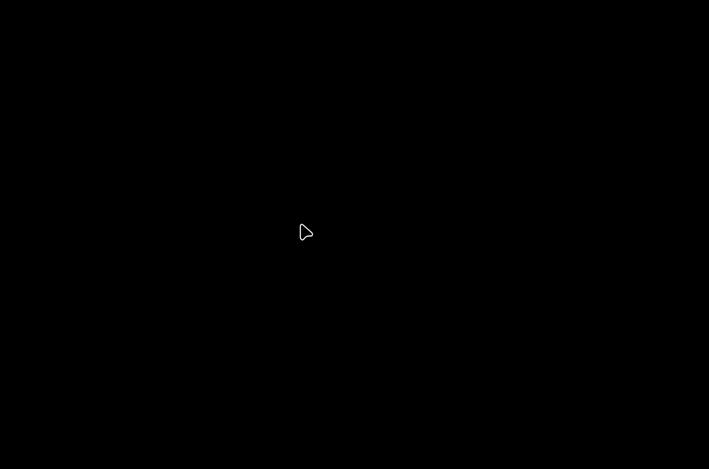

# 🌀 Project Light

Simple Reverse Raycasting in C++ with SDL2

This project is a basic implementation of **reverse raycasting** using **C/C++** and **SDL2** for rendering.
It serves as a minimal, educational example of how to simulate simple raycasting logic in a 2D environment.

---

## 📸 Demo



---

## 🔧 Features

- Basic 2D reverse raycasting logic
- Visual output using SDL2

---

## 🚀 Getting Started

### 📦 Requirements

- C++17 or higher
- [SDL2](https://www.libsdl.org/) installed

### 🛠️ Building

Make sure SDL2 is properly installed and accessible on your system.

```bash
make build

